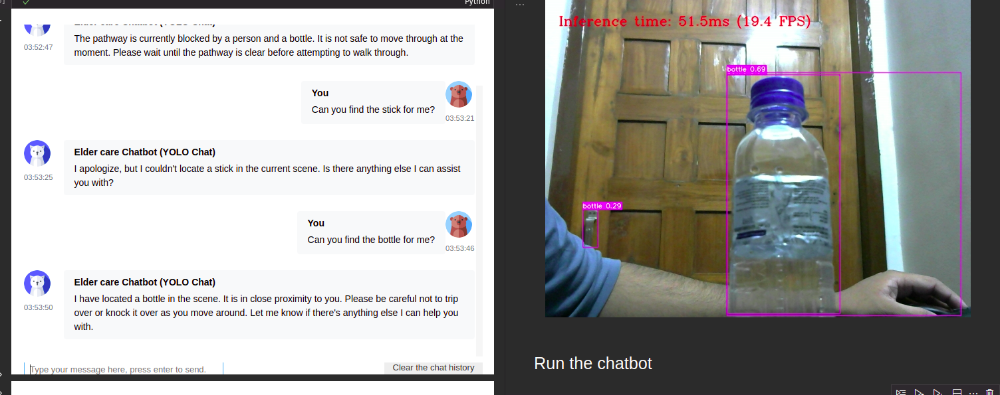

# An Elderly Indoor Care Chatbot (OpenVINO optimised YOLOv8 + OpenAI Chat API with functions)
This is a fun application of OpenVINO and OpenAI Chatbot API. (In more simple words a YOLO-Chat or chat with current scene)


## Some interesting capabilities of the chatbot:
- When asked about objects in the sorrounding, it can detect and answer questions about the objects.
- Currently, it can detect 80 different objects. (According to the COCO dataset)
- Uses a YOLOv8 model that is optimised using OpenVINO to run on CPU.
- Uses the functions capablities of OpenAI Chat API to trigger actions like finding nearby objects.
- __Implemented a pixel to meter estimation method that uses a range of real world scales of all 80 objects.__ Checkout the functions `calculate_center_and_scale`, `calculate_distance_matrix`, and `draw_results` at `utils/postProcess.py` and for the rough real world scale of 80 objects checkout the `coco_real_world_sizes` variable in `utils/objectDetect.py`. **(IMP - Most time spent here to find a way to get real world estimates, current accuracy is kinda bad. We use a map of real world estimates (unit:meter) of all 80 objects and did some scaling to find the distances of objects close and far from the camera)**

## How it works?
- The chatbot is initialised with a YOLOv8 model that is optimised using OpenVINO to run on CPU.
- The following is the system prompt that drives the GPT behaviour:
    ```
    You are an elderly care assistant.
    You have to help and guide the elderly in their daily life whenever they need it.
    You are are bot connected to a YOLO Camera.
    So you will have capablities to call functions to interact with the environment.
    ```
- When the users asks something like "Can I walk without bumping into anything?", the chatbot will do the following:
    - First collect all the frame data from a specified amount of time. (Refer `text_eventhandler` in `main.ipynb`. The `run_object_detection` calls `draw_results` which returns a matrix of distances between all objects in all the frames of the specified amount of time.)
    - Then pass the extracted data is passed to the helper function, in our case it will be `is_pathway_clear` in `main.ipynb` which will quickly check if the `all_detected_objects` is empty or not. Whatever the case maybe be it will return a string.
    - This string is then passed to the chat api to generate a meaningful response.

## How can this be used?
- This can be implemented as a plugin for smart home assistants.
- The elderly can ask questions like "Can I walk without bumping into anything?" or "Find my xyz object!" or "is the chair close?" and the chatbot will answer accordingly.

## How can this project be extended? (Since this is just an experimental project, we can extend it in the following ways)
- It runs of a notebook, this can be easily adapted to run on a smaller IoT device like a Raspberry Pi with connected camera and a microphone for user interactions.
- Should be trained with a lerger indoor objects dataset to be more accurate.
- We can add more useful functions like "check if anyone's at the door", "find my daughter" and so on. (When it comes to care of the elderly, the possibilities are endless.)

## How to run
1. Install the requirements:
    ```bash
    pip install -r requirements.txt
    ```
2. Create the optimized model by running the notebook cells at `prepareModel.ipynb` to convert the model to OpenVINO format. **(IMPORTANT)**
2. Run the cells at `main.ipynb` to start the chatbot and interact with it.
    
_Note: Demo won't work without creating the optimized model._

## Project file structure
- `utils/` - Contains all the helper functions.
    - `objectDetect.py` - Contains all the functions related to object detection.
        - `coco_real_world_sizes` A map of real world estimates (unit:meter) of all 80 objects from COCO dataset.
        - `run_object_detection` - Runs the object detection model on the input frame.
    - `postProcess.py` - Contains all the functions related to post processing of the object detection results.
        - `draw_results` - Draws the bounding boxes and calculates the distances between all objects in all the frames of the specified amount of time.
        - `calculate_distance_matrix` - Calculates the distance matrix between all objects in the frame.
        - `calculate_center_and_scale` - Calculates the center and scale of the object in the frame.
    - `videoPlayer.py` - Contains all the functions related to video playback.
    - `downloader.py` - Contains all the functions related to downloading files.
- `prepareModel.ipynb` - Converts the model to OpenVINO format.
- `main.ipynb` - Starts the chatbot and interacts with it. (As shown in the demo images below.)


## Demo (CPU)
_Live interaction with the scene using the chatbot. (Left - Chatbot, Right - Camera feed. Notebook split to show the camera feed which outputs the live frames a cell above the chatbot cell.)_



_OpenVINO Optimized YOLOv8 Model running on a CPU_

